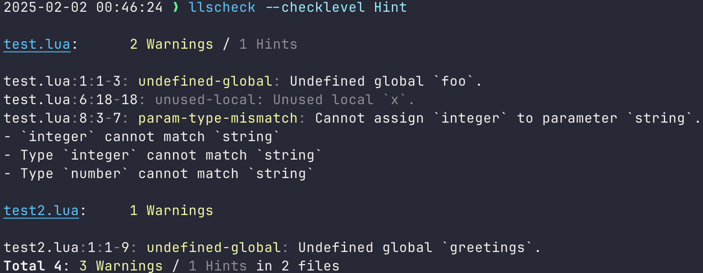

[](https://github.com/pre-commit/pre-commit)
[](https://github.com/jeffzi/llscheck/actions/workflows/luacheck.yml)
[](https://luarocks.org/modules/jeffzi/llscheck)

# llscheck

LLSCheck is a command-line utility that leverages the [Lua Language Server](https://luals.github.io)
for linting and static analysis of Lua code.

It delivers user-friendly reports, enhancing readability compared to raw JSON output. Moreover,
LLSCheck seamlessly integrates with popular CI tools, i.e the exit code is a failure when the Lua
Language Server finds issues.



## CLI

### Requirements

Lua Language Server must be [installed locally](https://luals.github.io/#other-install)
and `lua-language-server` must be in your $PATH.

### Installation

Using [LuaRocks](https://luarocks.org):

```bash
luarocks install llscheck
```

### Usage

```bash
llscheck --help
```

```
Usage: llscheck [-h] [--completion {bash,zsh,fish}]
       [--checklevel {Error,Warning,Information,Hint}]
       [--configpath <configpath>] [<workspace>]

Generate a LuaLS diagnosis report and print to human-friendly format.

Arguments:
   workspace             The workspace to check. (default: .)

Options:
   -h, --help            Show this help message and exit.
   --completion {bash,zsh,fish}
                         Output a shell completion script for the specified shell.
   --checklevel {Error,Warning,Information,Hint}
                         The minimum level of diagnostic that should be logged. (default: Warning)
   --configpath <configpath>
                         Path to a LuaLS config file. (default: .luarc.json)
```

## Docker

You can also run LLSCheck as a standalone Docker container.
To build your own, execute the following command from the source directory of this project:

```console
docker build -t llscheck https://github.com/jeffzi/llscheck.git
```

Optionally, you can pin the [version of Lua Language Server](<(https://github.com/LuaLS/lua-language-server/releases)>) with `--build-arg LLS_VERSION=3.7.0`.

Once you have a container you can run it with arguments:

```console
# Run llscheck on the src directory
docker run -v "$(pwd):/data" llscheck --checklevel Information src
```

On an Apple Silicon chip M1+, you'll need to add the option `--platform=linux/amd64` to both docker commands.

## Version control integration

Lua Language Server must be [installed locally](https://luals.github.io/#other-install)
and `lua-language-server` must be in your $PATH.

Use [pre-commit](https://pre-commit.com). Once you [have it installed](https://pre-commit.com/#install),
add this to the `.pre-commit-config.yaml` in your repository:

```yaml
repos:
  - repo: https://github.com/jeffzi/llscheck
    rev: latest
    hooks:
      - id: llscheck
        # args: ["--checklevel", "Hint"]
```
